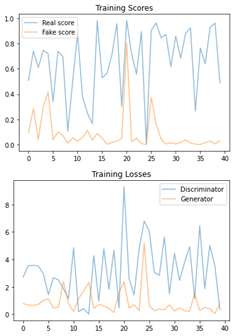

# GAN-DeepLearning-Coursework

This project is based on starter code provided in the Deep Learning course at University of Oulu.The project contains implementation of generative adversarial network (GAN) development for generating images from an anime face dataset.

